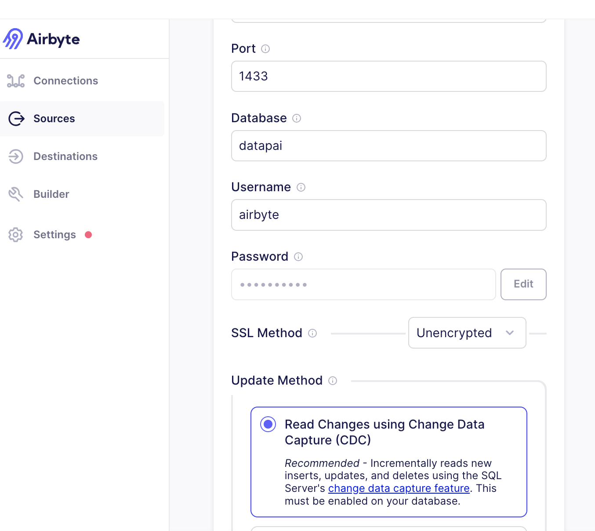

# dbt-demo
dbt demo project

docker run --name airbyte-mssql -e "ACCEPT_EULA=Y" -e "SA_PASSWORD=Welcome1$" -e "MSSQL_AGENT_ENABLED=True" -p 1433:1433 -d -v /home/ec2-user/git/dbt-demo/source/mssql/:/mssql mcr.microsoft.com/mssql/server:latest

docker exec -it airbyte-mssql /opt/mssql-tools/bin/sqlcmd -S localhost -U sa -P Welcome1$ -i /mssql/create_demo_tables.sql

docker exec -it airbyte-mssql /opt/mssql-tools/bin/sqlcmd -S localhost -U sa -P Welcome1$ -i /mssql/insert_sample.sql

docker exec -it airbyte-mssql /opt/mssql-tools/bin/sqlcmd -S localhost -U sa -P Welcome1$

 docker exec -it airbyte-mssql /opt/mssql-tools/bin/sqlcmd -S localhost -U sa -P Welcome1$ -i /mssql/create_demo_tables.sql

docker exec -it airbyte-mssql /opt/mssql-tools/bin/sqlcmd -S localhost -U sa -P Welcome1$ -i /mssql/insert_sample.sql

docker exec -it airbyte-mssql /opt/mssql-tools/bin/sqlcmd -S localhost -U sa -P Welcome1$ -i /mssql/user_grant.sql

docker exec -it airbyte-mssql /opt/mssql-tools/bin/sqlcmd -S localhost -U sa -P Welcome1$ -i /mssql/enable_cdc_2.sql

input in UI:

